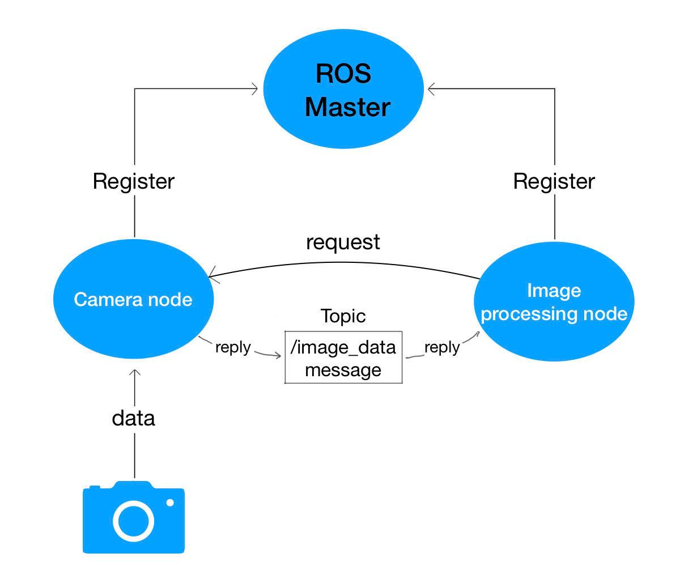

# ROS Basics

Before starting simulating and writing code for robots, it is important to know the key concepts of the framework. In this section, I will introduce essential keywords and commands.

### Workspace

Before starting to write any ROS code, we need to set up a `workspace`. A workspace is simply a set of directories related to ROS codes. We can create multiple workspaces, but can only work in one at time.
([Click here](./https://github.com/dcallega/ROS_Batbold_experience/tree/master/workspace) to learn **creating a workspace**)

### Package

ROS software is organized into *packages*, each of which contains some combination of code, data, and documentation. Packages are located in workspaces, in the *src* directory.
([Click here](./https://github.com/dcallega/ROS_Batbold_experience/tree/master/pkg) to learn **creating a package**)

### catkin

`catkin` is the ROS build system that ROS uses to generate executable programs, libraries, scripts, interfaces that other code can use. (For more information about catkin, [click here](http://docs.ros.org/melodic/api/catkin/html/index.html))

### master, node, message, topic

`node` is a piece of software that uses ROS libraries to communicate with other nodes. Nodes can publish and subscribe messages to a topic, where `topic` is a channel that sends only a certain type of message, and `message` is a ROS data type used for publishing and subscribing to a topic. And `master` allows all nodes to find and communicate with each other.

To understand these better, let's take an example.


                
In this example, a camera is sending raw data to `camera node` where data or msg is stored. And then, `image processing node` requests msg to `camera nod` and gets it via topic. Keep going, `display node` can request for processed images from `image processing node` and display the image on the monitor. Meanwhile, all this process is registered at ROS master.


### service

`service` is a synchronous way of communication that doesn't have to go through ROS master to find a node. Instead, request / reply is done via a Service, which is defined by a pair of messages: one for the request and one for the reply. The computations in a service callback should take a short, bounded amount of time to complete.
(For more information about service, [click here](http://wiki.ros.org/Services))

### action

`action` is an asynchronous method of communication that uses a goal to initiate a behavior and sends a result when the behavior is complete. But action further uses feedback to provide updates and allow actions to be canceled. Actions are themselves implemented using topics. An action is essentially a higher-level protocol that specifies how a set of topics (goal, result, feedback, etc.) should be used in combination.
(For more information about action, [click here](https://www.mathworks.com/help/ros/ug/ros-actions.html))

### roscore

`roscore` is a service that provides connection information to nodes so that they can transmit messages to one another. Every node connects to roscore at startup to register details of the message it publishes it to nodes wish to subscribe. When a new node appears, `roscore` provides it with the information that it needs to form a direct connection with other nodes publishing and subscribing to the same message topics. Every ROS system needs a running roscore, and nodes cannot find other nodes without it.

You need to run `roscore` before launching anything. However, when you run *launch file* using `roslaunch`, `roscore` is automatically ran

### rosrun

`rosrun` is a command that run *nodes* from packages from anywhere without having to give its full path or cd/roscd there first.

***Usage:***

> ```
> $ rosrun <package> <executed file>
> ```
*Example:*
> ```
> $ rosrun roscpp_tutorials talker
> ```
It's also possible to pass a parameter using the following syntax:
> ```
>$ rosrun package node _parameter:=value
> ```

### roslaunch

`roslaunch` is a command designed to automate the launching of multiple ROS nodes. It may look like `rosrun`, requiring package name and a filename:
> ```
> $ roslaunch PACKAGE LAUNCH_FILE
> ```
However, `roslaunch` only operates on *launch files*, rather than nodes. Launch files are [XML](https://fileinfo.com/extension/xml) files that describe a collection of nodes along with their topic remappings and roslaunch parameters. By convention, these files have a extension of *.launch*.

*Example:*

> ```
> $ roslaunch turtlebot_gazebo turtlebot_world.launch
> ```


### rospack

`rospack` is a command tool for getting information about ROS packages available on the system. It uses various commands from locating, listing packages, and calculating dependencies tree of packages.


### roscd

`roscd` allows you to change directories using a package name, or special location.

***Usage:***
> ```
> $ roscd <package>[/subdirection]
> ```

Also, the ROS_LOCATIONS environment variable can be used to add additional special locations for use with roscd. ROS_LOCATIONS is a colon-separated list of key=path pairs.
For example, adding the following to your .bashrc file:
> ```
> $ export ROS_LOCATIONS="pkgs=~/ros/pkgs:dev=~/ros/dev"
> ```
### rosls

`rosls` allows you to view the contents of a package, or location.
